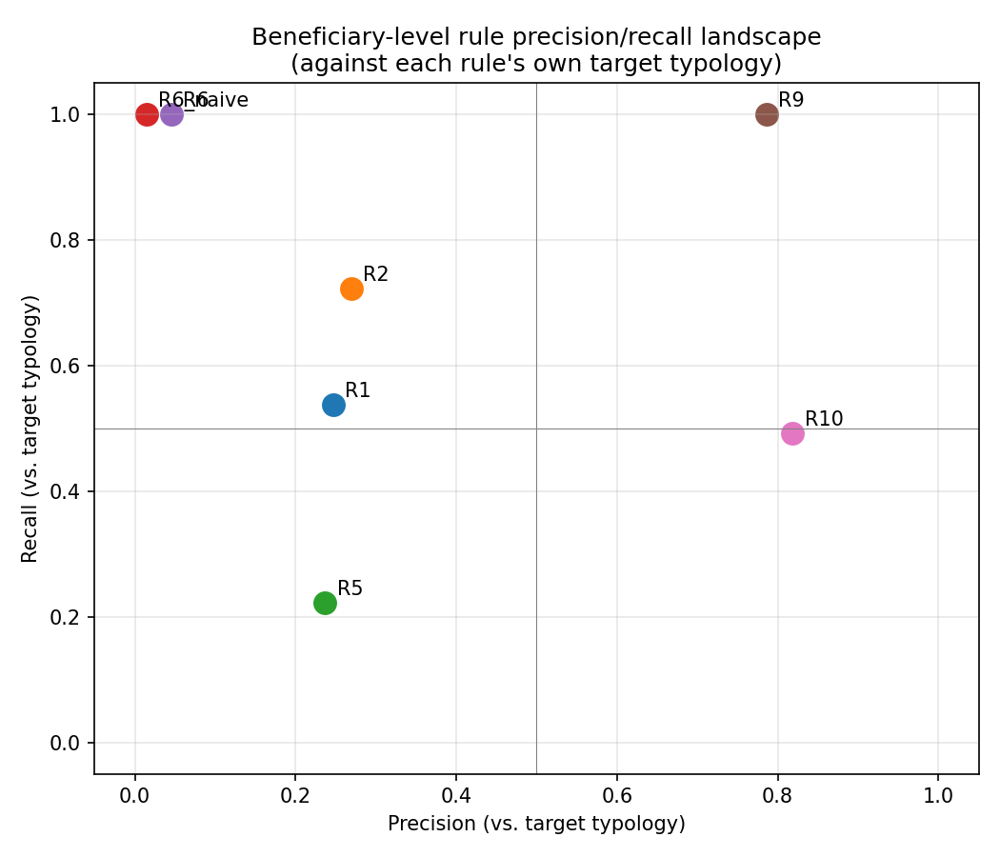
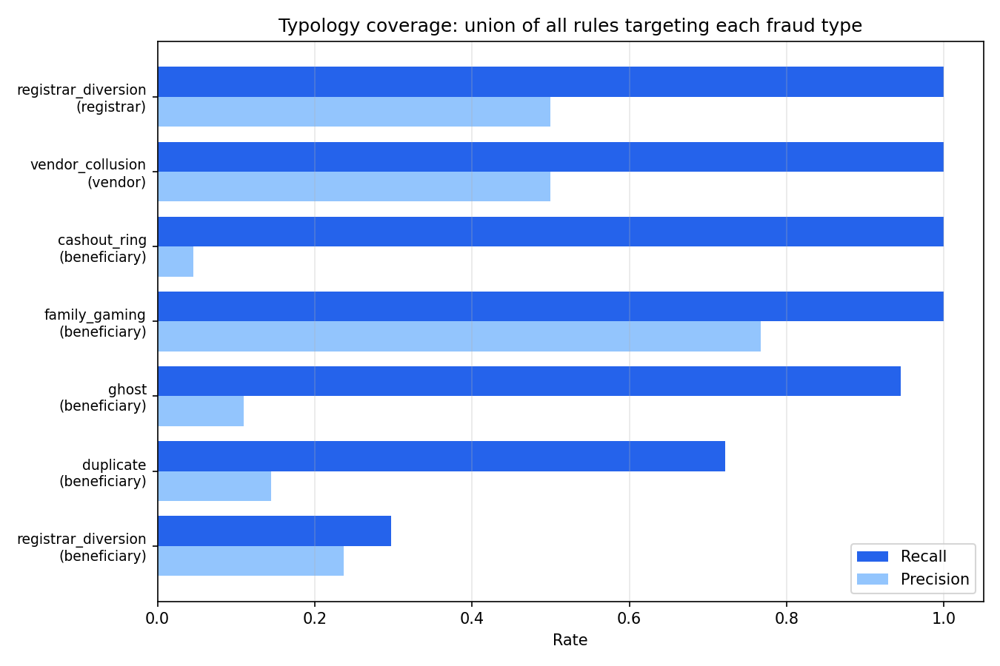
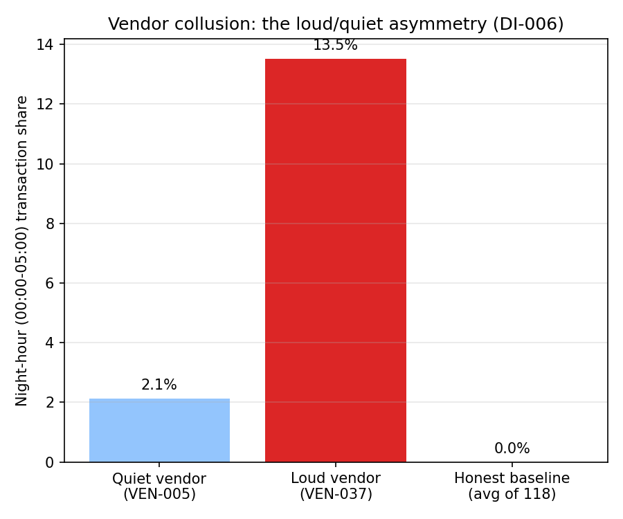
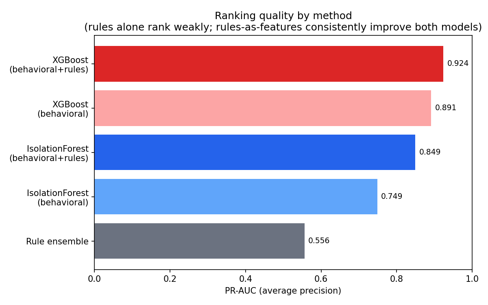
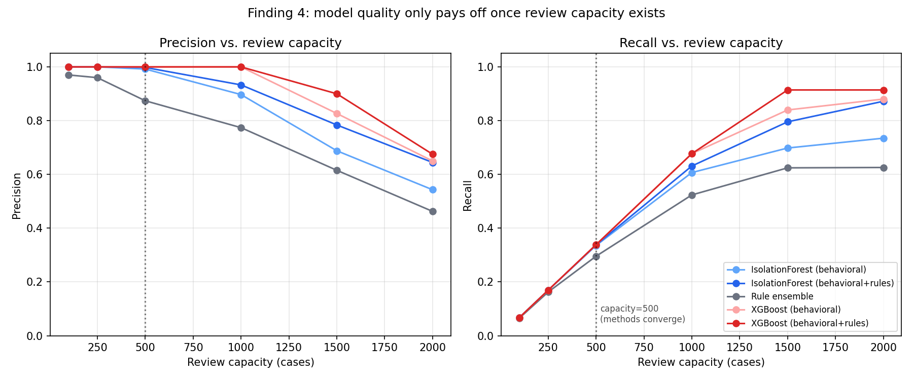

# Syria Humanitarian Cash-Transfer Fraud Detection

A synthetic dataset and detection pipeline modeling fraud in a
cross-border humanitarian cash-assistance program in northwest Syria —
built to answer a specific question: **do standard fraud-detection
techniques actually work in a cash economy**, where fast, full cash-out
is normal behavior rather than a red flag?

This project started from something I saw firsthand as a humanitarian worker in Syria: fraud that reaches an analyst's dashboard has usually already passed through people in the field who noticed something first — sometimes because a beneficiary asked them directly if what they were doing was allowed. Most weren't stealing; they were making an understandable choice that still cost someone else in the same program. I built this project to combine that field-level understanding of Syria's economy and its people with the analytical side — the part that usually never talks to the part that saw it happen first.
 

**Tech stack:** Python, pandas, SQLite, scikit-learn, XGBoost.
**Scale:** 49,928 beneficiaries, 120 vendors, 12 registrars, 1.7M
transactions, 12 monthly voucher cycles.

---

## Contents

- [Background](#background)
- [The six fraud typologies](#the-six-fraud-typologies)
- [Dataset design](#dataset-design)
- [Detection approach](#detection-approach)
- [Results](#results)
- [The cash-economy finding](#the-cash-economy-finding)
- [A corrected claim](#a-corrected-claim)
- [Limitations](#limitations)
- [Repository structure & reproducing this](#repository-structure--reproducing-this)

---

## Background

Cross-border cash-assistance programs in NW Syria distribute vouchers to
beneficiaries who redeem them at registered vendors. The fraud patterns
modeled here are drawn from documented cases (USAID OIG investigations
into Syria cross-border programs, Syria Humanitarian Fund risk reports,
UNHCR deduplication literature) plus firsthand field experience with one
typology (intra-family eligibility gaming) that isn't well-documented in
public reporting.

The central design constraint: **Syria runs on cash.** There are no
card rails, and even people with bank accounts withdraw deposits
immediately. That means "fast, full redemption" — the textbook
fraud-velocity signal in most fintech fraud literature — is normal
behavior for a large share of the honest population here, not evidence
of anything. A detection system built on Western banking assumptions
would misfire badly. Testing whether that's actually true, with real
numbers rather than assertion, is the point of this project.

## The six fraud typologies

| Typology | Scheme | Real-world basis |
|---|---|---|
| **Ghost beneficiaries** | Fictitious registrants, vouchers cashed out by an insider through a colluding vendor | USAID OIG Syria cross-border cases, 2016–2018 |
| **Duplicate registration** | One real person registers multiple times under name-transliteration variants | Documented in Syria/regional refugee response dedup exercises (UNHCR) |
| **Intra-family eligibility gaming** | Every adult in a family registers separately, all claim the same full household size | Firsthand field observation, not well-documented elsewhere |
| **Vendor collusion** | A vendor inflates transactions or processes fabricated redemptions | SHF/WFP Syria monitoring reports, USAID OIG vendor kickback cases |
| **Registrar-level diversion** | A compromised staff member drives an elevated rate of other typologies through their own caseload | Post-2025 governance-gap and partner-staff fraud cases |
| **Cash-out ring** | Coordinated trafficking of entitlements through synchronized redemption at a colluding vendor | Revised specifically for the cash-economy constraint above — the signal is coordination, not speed |

## Dataset design

The dataset is fully synthetic and generated from a fixed seed, so
nothing here is real beneficiary data — but a lot of the realism comes
from domain corrections that a purely spec-driven build would have
gotten wrong. Some examples:

- Transaction amounts were originally calibrated like a US grocery run.
  Corrected after direct domain input: food is cheap enough in this
  economy that a kilo of tomatoes runs under a dollar, and even medicine
  is priced closer to WHO/HAI comparator-country data than to US
  pricing. The corrected model has honest beneficiaries making frequent
  small purchases (under $1 is normal) punctuated by one larger
  bulk-staples stock-up per cycle, not evenly-sized transactions.
- Real Idlib/Aleppo district names, an Arabic name-transliteration
  variant system (45 first names × 60 family names, each with 2–4
  documented Latin spellings), and two deliberate false-positive traps
  baked into the honest population — extended families sharing one
  phone, and large legitimate families whose registrants' claimed
  household sizes are consistent (not identical) splits of the real
  total. Both traps exist specifically to stress-test the detection
  rules against real ambiguity, not just against fraud.

**Every point where domain knowledge overrode a spec-default is logged
with before/after/reasoning/downstream-effect in
[`specs/domain_interventions.md`](specs/domain_interventions.md)** — this
is a project deliverable in its own right, not incidental notes. It's
also where a design flaw in the original vendor-collusion mechanism (an
early attempt just reshaped existing fraud transactions, which can't
actually produce a vendor-fabricates-its-own-volume scheme) got caught
and fixed with a proper phantom-transaction mechanism instead.

## Detection approach

Two layers, kept strictly separate from ground truth until evaluation:

**1. Rule-based system (R1–R10).** Hand-built detection rules, each
targeting a specific typology — shared-phone clustering, name-similarity
with a shared attribute, vendor night-transaction share, cross-district
redemption, registration bursts, registrar aggregate flag rate, identical
household-size clustering, bulk same-day merchant redemption, and a
revised cash-out velocity rule. A deliberately naive version of the
velocity rule (speed + fullness alone, no locality or coordination check)
is kept in the results specifically to demonstrate its failure mode in a
cash economy — see below.

**2. ML comparison (IsolationForest + XGBoost).** Engineered behavioral
features (transaction timing, vendor concentration, attribute clustering)
plus, in a second tier, the rule flags themselves as additional features
— testing whether ML adds value *on top of* the rules rather than
replacing them. IsolationForest never sees fraud labels during fitting;
XGBoost is trained supervised on a held-out split, the way real
supervised fraud models are built from confirmed past cases.

Scoped deliberately to beneficiary-level fraud for the ML comparison:
vendor collusion (2 true positives) and registrar diversion (1) don't
have enough positive examples for train/test ML or a meaningful anomaly
threshold. Those two stay owned by the relative-threshold rules.

## Results

### Rule-by-rule performance



| Rule | Precision | Recall | Note |
|---|---|---|---|
| R1 (shared phone ≥3) | 24.7% | 25.4% | |
| R2 (name + shared attribute) | 58.1% | 52.6% | 26.9%/72.2% vs. duplicates alone |
| R3 (vendor night-share, relative) | — | 1/2 vendors | catches the loud vendor, misses the quiet one |
| R4 (vendor volume, relative) | — | 0/2 vendors | flags neither true vendor — see Limitations |
| R5 (registration burst) | 25.1% | 4.7% | weak recall — bursts get diluted by ordinary daily registration volume |
| R6-naive (speed + fullness only) | 5.3% | 74.0% | precision collapse — see [below](#the-cash-economy-finding) |
| R6 (revised: fast + non-local/coordinated) | 8.7% | 39.0% | 100% recall on cash-out ring specifically |
| R7 (cross-district redemption, relative) | — | 2/2 vendors | catches both colluding vendors |
| R8 (registrar flag-rate, relative) | — | 1/1 registrar | exact hit, zero false positives |
| R9 (identical household-size cluster) | 100.0% | 41.1% | |
| R10 (bulk same-day merchant redemption) | 97.9% | 19.0% | |

### Combining rules beats trusting any single one

Single best beneficiary-level rule against all fraud combined: R2 at
58.1% precision / 52.6% recall. Requiring **two independent rules to
agree**: 72.5% precision, 62.3% recall — better on *both* axes at once,
not a trade-off. The registrar-level ensemble is stronger still: R5 and
R8 individually are weak-to-middling, but requiring both to agree hits
**100% precision, 100% recall** on the one compromised registrar, zero
false positives.

### Typology coverage



| Typology | Recall | Precision | Rules |
|---|---|---|---|
| Family gaming | 100.0% | 76.7% | R9, R10 |
| Cash-out ring | 100.0% | 4.5% | R6 |
| Ghost (beneficiary-level) | 94.5% | 10.9% | R1, R5 |
| Vendor collusion | 100.0% | 50.0% | R3, R4, R7 |
| Registrar diversion (registrar-level) | 100.0% | 50.0% | R5, R8 |
| Duplicate | 72.2% | 14.5% | R1, R2 |
| Registrar diversion (beneficiary-level) | 29.7% | 23.6% | R5, R8 |

**Intra-family eligibility gaming is the easiest typology here by a wide
margin** — both its rules are aggregation-based (address/household
clustering, bulk-same-day pattern), and aggregation is exactly what
defeats a typology that's individually clean by design. **Registrar
diversion splits sharply by entity level** — trivial to catch the
registrar itself, much harder to catch each individual beneficiary it
processed (29.7% recall). The practical read: once a registrar is
flagged, audit their full caseload directly rather than waiting for each
beneficiary to independently trip a rule.

### The vendor loud/quiet asymmetry



Two vendors are colluding in this dataset, built with deliberately
different profiles: one processes fabricated transactions against real
beneficiaries' unspent voucher balances (small-dollar, hard to spot on
volume alone), the other launders ghost-beneficiary redemptions (larger,
regular, but a small share of its overall traffic). At the rule level,
requiring two rules to agree catches only the "loud" vendor — the "quiet"
one is only ever caught by one specific rule (cross-district redemption
share) alone. This asymmetry was built into the dataset on purpose and
confirmed here from the detection side.

### ML comparison, reported at realistic review-capacity, not an oracle cutoff

**PR-AUC by method** (full population for IsolationForest; XGBoost on its
held-out test set only):



| Method | Features | PR-AUC |
|---|---|---|
| Rule ensemble | vote count | 0.556 |
| IsolationForest | behavioral | 0.749 |
| IsolationForest | behavioral+rules | 0.849 |
| XGBoost (test set) | behavioral | 0.891 |
| XGBoost (test set) | behavioral+rules | **0.924** |

**Rules know things models can't see; models rank things rules can't
order.** The rule ensemble alone is a weak ranker (PR-AUC 0.556 — vote
count doesn't order cases well, it just buckets them). But adding rule
flags as ML features buys a consistent gain on both models: +0.100 for
IsolationForest, +0.033 for XGBoost. Rule flags encode relational facts —
shared phones, address clusters, cross-vendor coordination — that don't
exist anywhere in a beneficiary's own transaction history no matter how
it's aggregated. A behavioral feature vector can't express "this
person's phone is shared with two other registrants"; a rule flag can.



**Model quality only pays off once review capacity exists.** At a
review budget of 500 cases, every method — the weakest rule ranker and
the strongest ML model alike — converges to roughly the same ~34%
recall, because every ranker front-loads the same easy fraud first
(family gaming, ghosts). Model quality only starts to differentiate
outcomes once the budget pushes past what the easy cases alone can fill:
at capacity 1,500, IsolationForest (behavioral+rules) reaches 79.6%
recall at 78.4% precision against the rule ensemble's 62.4%/61.5% at the
same budget. **The practical implication: upgrading the model buys
nothing until the investigation team is funded to work deeper into the
queue.** Detection capacity and investigation capacity are complements,
not substitutes.

## The cash-economy finding

This is the finding the whole project was built to test. The naive
version of the cash-out velocity rule — flag anyone who redeems fast and
fully — is the textbook fraud signal in most fraud-analytics literature,
and it **collapses on precision here**: 5.3% precision against all fraud
(1.5% against its specific target), while still catching 74–100% of the
fraud it's aimed at. It's not a subtle miss — the vast majority of what
it flags is honest. The reason is structural, not a tuning failure: in a
cash economy, fast full redemption is what roughly 40% of the *honest*
population does too, because there's no reason to hold a voucher balance
you can't meaningfully bank. A rule imported wholesale from a
card-based-economy fraud playbook would flag nearly half the honest
population as suspicious.

The fix isn't a better threshold — it's a different question. The
revised rule (R6) asks whether fast, full redemption is *also*
non-local or *coordinated with other beneficiaries at the same
vendor and hour* — speed alone isn't the signal, speed plus something
that doesn't happen by coincidence is. That single reframing takes
precision from 5.3% to 8.7% while holding 100% recall on the actual
fraud ring, and it's the difference between a rule that's usable and one
that isn't.

## A corrected claim

An earlier draft of the ML results reported "XGBoost recovers 90.1% of
the compromised registrar's under-signalled beneficiaries, vs. 77.7% for
the rule ensemble." That number was computed at an oracle cutoff — top-K
where K equals the exact number of true fraud cases, which is only
knowable in a synthetic dataset with ground truth, never in a live
deployment. At a realistic review-capacity operating point (500 cases),
the actual recovery is: rule ensemble 43.1%, IsolationForest
(behavioral+rules) 54.4%, XGBoost (behavioral+rules) 44.4% — all four
methods land in a much tighter, much less flattering band. The
qualitative finding survives (ML does modestly outperform the rule
ensemble on this segment, and the gap widens with more review capacity —
verified 77.7% vs. 87.6% at capacity 1,500), but the original number
overstated it by conflating "better ranking" with "catches almost
everyone," which only holds at a review budget no real team has.

Leaving this in the README rather than quietly fixing the number: the
methodology mistake (oracle-K evaluation reads as a real operating point
but isn't one) is common enough in fraud-analytics writeups that it's
worth naming directly, not just correcting silently.

## Limitations

**The "hard" ~30% of duplicate registrations are essentially uncatchable
by every method tested, including ML.** These are duplicate IDs that
share neither phone nor address with their anchor identity — the
deliberately harder case, per the underlying typology research. Recovery
across every method: IsolationForest 0%, XGBoost (behavioral) 0%,
XGBoost (behavioral+rules) 2.6%. This isn't a tuning gap. These
duplicate records are generated through the *same* behavioral simulator
used for the honest population, so their transaction patterns are drawn
from an identical distribution — there is no per-record signal to find,
by construction. The only real signal is a *pairwise* relationship (this
name is a transliteration variant of that other specific person's name),
which doesn't fit into a standard tabular feature vector regardless of
model sophistication. Closing this gap needs record-linkage / entity-
resolution techniques operating over the population as a graph, not a
per-beneficiary classifier scored one row at a time.

**Vendor- and registrar-level fraud have too few positive examples for
ML.** 2 colluding vendors, 1 compromised registrar — the relative-
threshold rules are the right tool at that scale, not a train/test model.

**This is a synthetic dataset.** Real-world deployment would need actual
transaction data, and several calibration choices (comparator-country
medicine pricing rather than Syria-specific data, for instance) are
logged as open items in `specs/domain_interventions.md` rather than
presented as settled.

This project is the starting point of a longer interest, not a one-off. Syria's reopening to the world — coming after the fall of Assad and the end of over 40 years of sanctions — creates real opportunity, but also real exposure: fraud tends to scale with new financial access before oversight catches up, and it's ordinary people who bear that cost first. My next projects stay on this track: mapping fraud and financial-crime risk in a post-Assad, post-sanctions Syria.

## Repository structure & reproducing this

```
├── specs/                        typology research, schema design, domain corrections log
├── src/
│   ├── generate_population.py    honest population + two false-positive traps
│   ├── inject_fraud.py           all six fraud typologies + answer key
│   ├── rules.py                  detection rules R1-R10
│   ├── evaluate.py               precision/recall/F1 per rule, per typology
│   ├── model.py                  IsolationForest + XGBoost comparison
│   ├── visualize.py              generates all figures in notebooks/figures/
│   ├── build_sample_db.py        builds the small sample DB below
│   ├── names_data.py             Arabic name-transliteration variant library
│   └── geo_data.py               district/geography reference data
├── data/
│   ├── sample_aid_program.db     small sample DB (see below) -- committed
│   ├── rule_evaluation.csv       full per-rule metrics
│   └── ml_comparison.csv         full capacity-sweep ML comparison
└── notebooks/figures/            all charts in this README
```

**The full dataset (49,928 beneficiaries, ~310MB) is not in this repo** —
it's fully reproducible from the seed and doesn't belong in version
control. What *is* committed is `data/sample_aid_program.db`, a ~26MB
SQLite database built by `build_sample_db.py` that keeps every fraud
example intact (all 1,478 flagged beneficiaries across all six
typologies, so nothing is missing), both honest false-positive traps in
full, plus a random sample of ~3,000 additional honest beneficiaries —
small enough to commit, complete enough to actually explore with SQL.

To reproduce the full pipeline:

\`\`\`bash
pip install -r requirements.txt

python src/generate_population.py --seed 42 --db data/aid_program.db
python src/inject_fraud.py --seed 42 --db data/aid_program.db
python src/rules.py --db data/aid_program.db
python src/evaluate.py --db data/aid_program.db
python src/model.py --db data/aid_program.db
python src/visualize.py --db data/aid_program.db
python src/build_sample_db.py --db data/aid_program.db --out data/sample_aid_program.db
\`\`\`

Everything is seeded (\`--seed 42\` by default) — the same command
sequence reproduces the exact numbers in this README.
